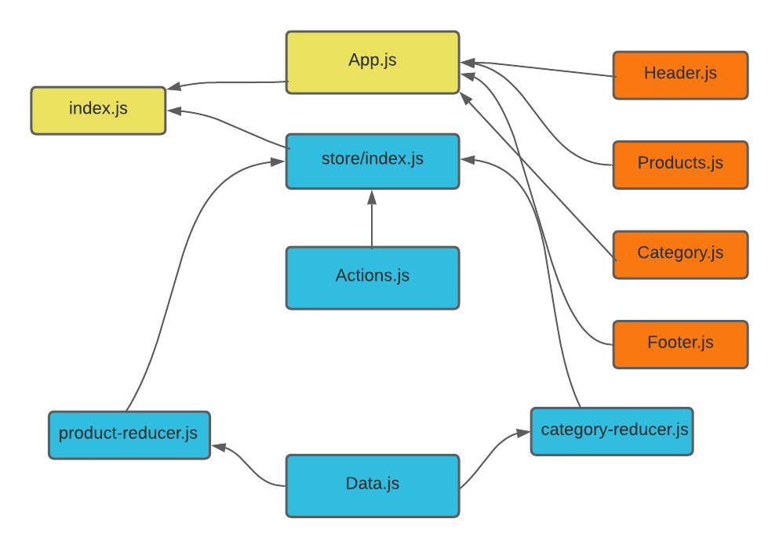
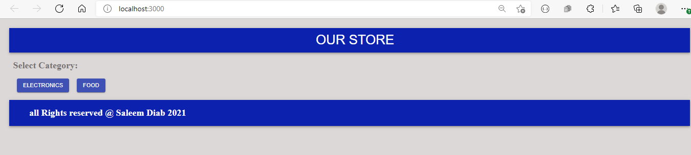
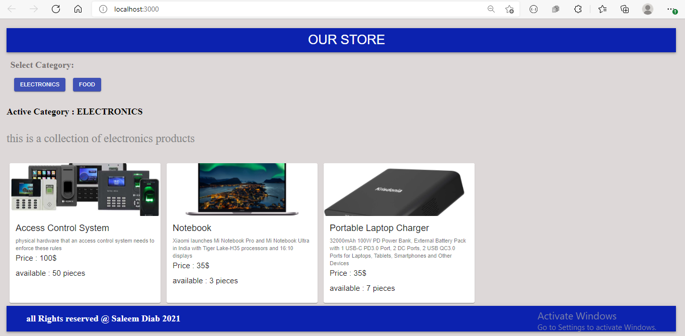
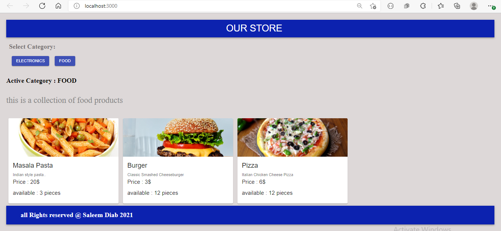
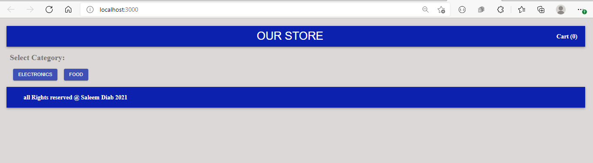
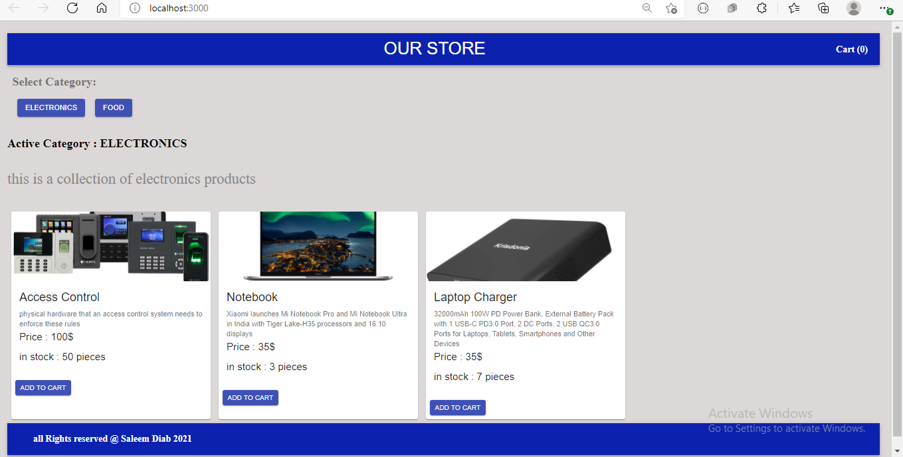
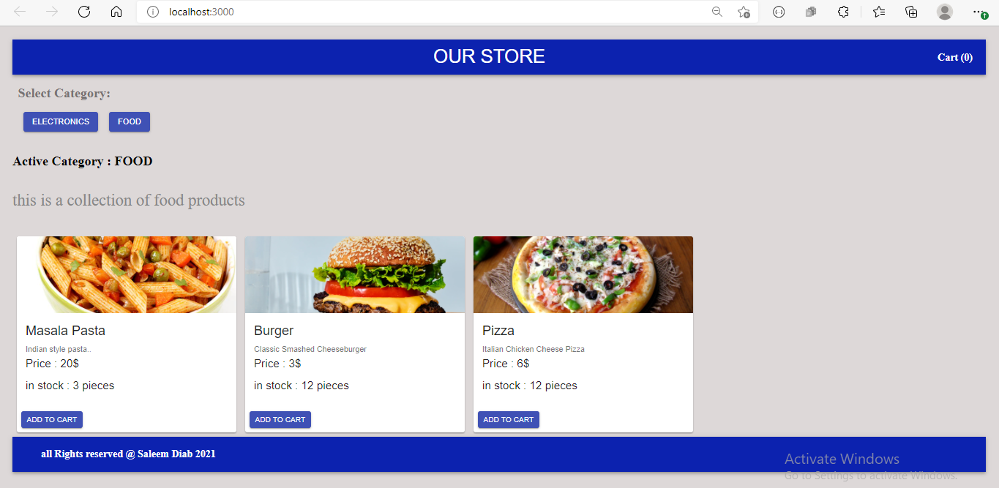
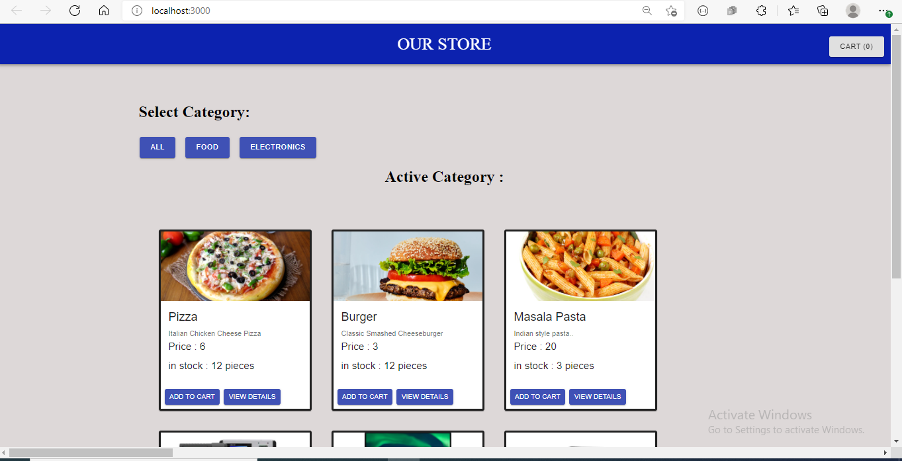
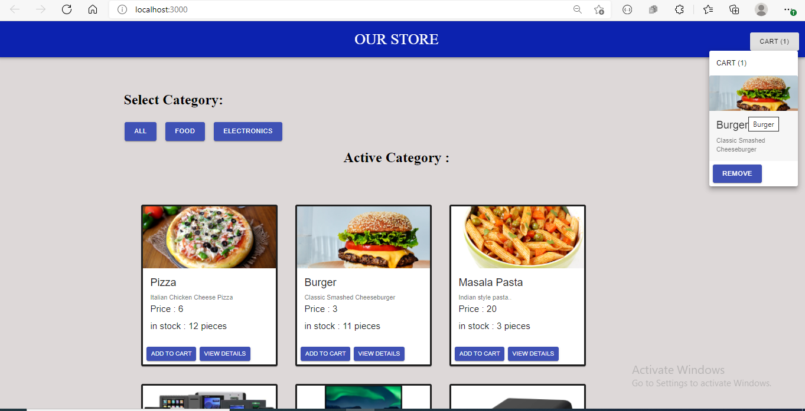

# storefront

## Author : Saleem Diab

## LAB 36 -  Application State with Redux

## Description :

* ### an application that will power an online storefront that will allow our users to browse our product offerings by category, place items in their shopping cart, and check-out when they are ready to make their purchase

##  store-front App Phase 1:

### In Phase 1, setup the basic scaffolding of the application with initial styling and basic behaviors. This initial build sets up the file structure and state management so that we can progressively build this application in a scalable manner

The following user/developer stories detail the major functionality for this phase of the project.

1.  As a user, I expect to see a list of available product categories in the store so that I can easily browse products

2. As a user, I want to choose a category and see a list of all available products matching that category

3. As a user, I want a clean, easy to use user interface so that I can shop the online store with confidence

## Links and Resources:

* ### [code sand box /Phase 1](https://8jj7j.csb.app/)

* ### [lab 31 pull request ](https://github.com/saleem-ux/storefront/pull/1)

## UML : 

## result /lab 31 :

## LAB 37 - Redux - Combined Reducers

##  store-front App Phase 1:

### Virtual Store Phase 2: Continue work on the e-Commerce storefront, breaking up the store into multiple reducers and sharing functionality/data between components

The user stories from Phase 1 remain unchanged. For this phase, we are now adding the following new user stories to meet the new requirements.

1. As a user, I want to choose from products in the list and add them to my shopping cart
2. As a user, I want to see the products that I’ve added to my shopping cart so that
3. As a user, I want to change the quantity of items I intend to purchase in my shopping cart
4. As a user, I want to be able to remove an item from my shopping cart

## Links and Resources:

* ### [code sand box /Phase 2](https://72dpk.csb.app/)

* ### [lab 37 pull request ](https://github.com/saleem-ux/storefront/pull/2)

## UML : 

## result /lab 37 :

## LAB 38 - Redux - Asynchronous Actions

##  store-front App Phase 3:

### Virtual Store Phase 3: Connect the Virtual Store to an API to retrieve live data from your data source, using thunk to enable asynchronous actions

In phase 3, we will be connecting our Virtual Store to a live API so that our data is persistent and able to be separately managed.

The user stories from Phases 1 and 2 remain unchanged. For this phase, we are now adding the following new user stories to meet the new requirements.

1. As a user, I want to interact with live inventory so that I have confidence that the displayed products are in stock
2. As a user, I want to know to that when I add an item to my cart, that it is removed from inventory so that no other users can purchase it

## Links and Resources:

* ### [store-server-Heroku](https://store-server-1.herokuapp.com/)

* ### store-server-Heroku-endpoints
   * ### https://https://store-server-1.herokuapp.com/product
   * ### https://store-server-1.herokuapp.com/cartItem

* ### [store-server-repo]()   

* ### [code sand box /Phase 3]()

* ### [lab 38 pull request ]()

## UML : 

## result /lab 38 :

### click on cart button to show items in cart and if you want to remove ant item :

